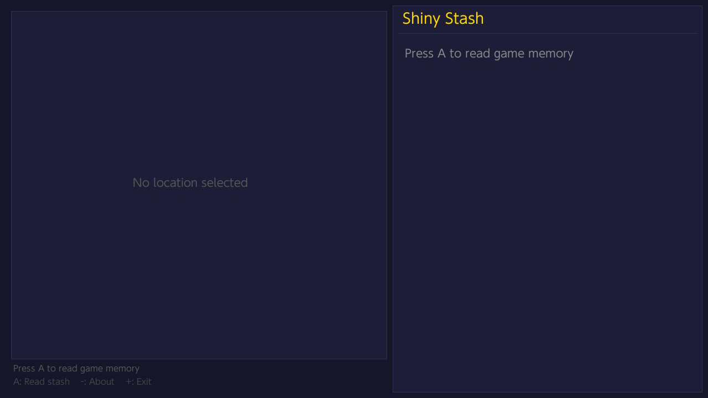
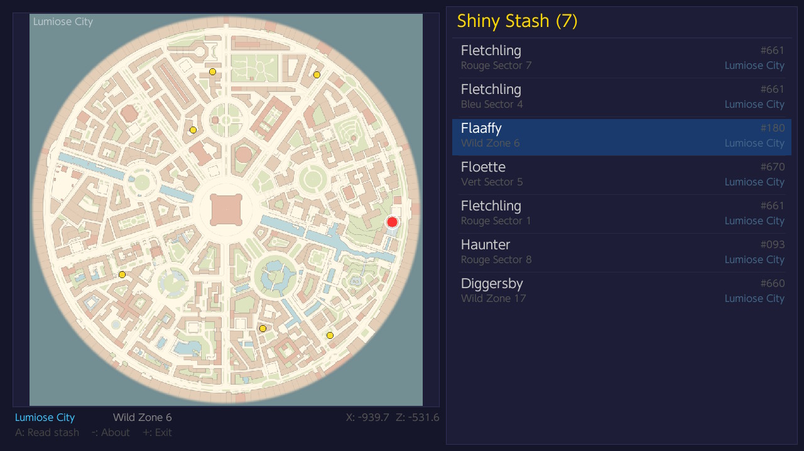
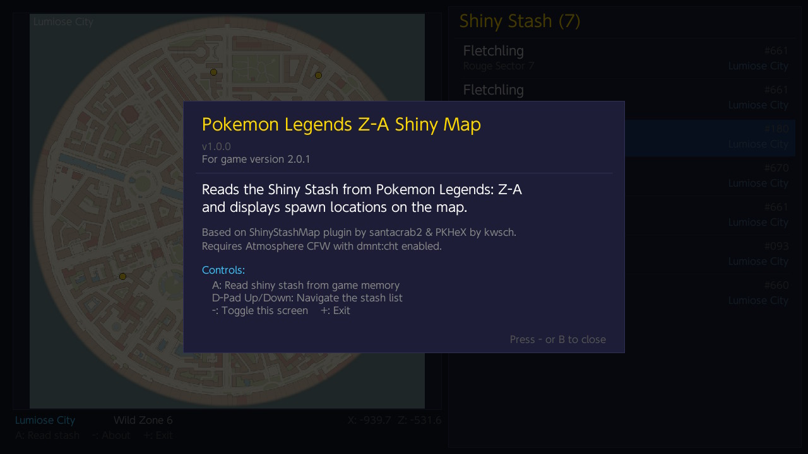

# Pokemon Z-A Shiny Stash Live Map

A Nintendo Switch homebrew application that reads the Shiny Stash from **Pokemon Legends: Z-A** in real-time and displays each entry's spawn location on an interactive map.

## What it does

- Reads the Shiny Stash block (up to 10 entries) directly from game memory via Atmosphere's `dmnt:cht` service
- Displays an interactive list of all stashed shiny Pokemon with species name, Pokedex number, and spawn location
- Shows the selected Pokemon's spawn point on the corresponding map (Lumiose City, Lysandre Labs, The Sewers, The Sewers B)
- All other stash entries on the same map are shown as gold dots for an overview of your shiny locations
- Decrypts PKX-encrypted PA9 data and converts Gen9 internal species IDs to National Dex numbers

## Compatible game versions

The application automatically detects the running game version and adjusts accordingly. Supported versions:

- **1.0.3**
- **2.0.0**
- **2.0.1**

## How to use

1. Launch Pokemon Legends: Z-A.
2. Press the **Home** button and launch the Homebrew Menu via the Album icon.
3. Start the Shiny Stash Live Map homebrew application from the Homebrew Menu.
4. The app will automatically read the Shiny Stash from the game's memory and display the list of stashed shiny Pokemon along with their spawn locations on the map.
5. Use the D-Pad to navigate the list of stashed Pokemon. The selected Pokemon's spawn point will be highlighted on the map, and other stashed Pokemon on the same map will be shown as gold dots.
6. Press the **-** button to toggle the About screen with project information and credits.
7. Press the **+** button to exit the application and return to the Homebrew Menu


## Requirements

- Nintendo Switch with [Atmosphere](https://github.com/Atmosphere-NX/Atmosphere) CFW
- `dmnt:cht` service enabled (default in Atmosphere)
- Pokemon Legends: Z-A must be running in the background

## Controls

| Button | Action |
|--------|--------|
| **A** | Read shiny stash from game memory |
| **D-Pad Up/Down** | Navigate the stash list |
| **-** | Toggle About screen |
| **+** | Exit |

## Building

### Prerequisites

- [devkitPro](https://devkitpro.org/) toolchain with devkitA64
- Switch portlibs: `switch-sdl2`, `switch-sdl2_image`, `switch-sdl2_ttf`, `switch-freetype`, `switch-harfbuzz`, `switch-libpng`, `switch-libjpeg-turbo`, `switch-libwebp`, `switch-zlib`, `switch-bzip2`

Install dependencies via devkitPro's pacman:

```bash
(dkp-)pacman -S switch-sdl2 switch-sdl2_image switch-sdl2_ttf switch-freetype switch-harfbuzz
```

The `dmnt:cht` library (`libdmntcht.a` and `include/switch/dmntcht.h`) is bundled in the project under `lib/` and `include/`.

### Build

```bash
make all
```

This produces `Shiny-Stash-Live-Map.nro`. Copy it to your Switch's SD card under `/switch/`.

## Project structure

```
Shiny-Stash-Live-Map/
  source/main.cpp          Main application source
  include/switch/dmntcht.h  dmnt:cht service header
  lib/libdmntcht.a          dmnt:cht static library
  romfs/
    lumiose.png             Lumiose City map
    LysandreLabs.png        Lysandre Labs map
    Sewers.png              The Sewers map
    SewersB.png             The Sewers B map
    t1_point_spawners.txt   Lumiose City spawner data
    t2_point_spawners.txt   Lysandre Labs spawner data
    t3_point_spawners.txt   The Sewers spawner data
    t4_point_spawners.txt   The Sewers B spawner data
    species_en.txt          Pokemon species name table
```

## Screenshots
<div align="center">
    
    
    
</div>

## Disclaimer

This application is currently **in development** and may contain bugs or incomplete features. It is provided "as-is" without warranty of any kind. The authors cannot be held responsible for any damage to your console, save data, or any other issues arising from the use of this software. Use at your own risk.

## Credits

- **[ShinyStashMap](https://github.com/santacrab2/ShinyStashMap)** by santacrab2 - Reference for shiny stash block parsing, spawner data, map transforms, and pointer chain
- **[PKHeX](https://github.com/kwsch/PKHeX)** by kwsch - Reference for PA9 structure, PKX encryption/decryption, Gen9 species conversion, and SCBlock format
- **[Atmosphere](https://github.com/Atmosphere-NX/Atmosphere)** - dmnt:cht debug monitor service for live memory access
- **[devkitPro](https://devkitpro.org/)** - Nintendo Switch homebrew toolchain
